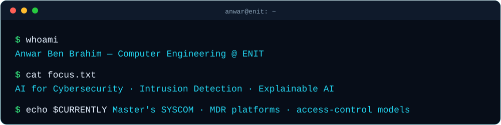

  

    

  
  
  
  

    

  
  

 

## About

  

 

Computer engineering student at **ENIT** with hands-on experience across **artificial intelligence,
machine learning and cybersecurity** — spanning academic, and engineering work.

I like the part of the machine you don't see: from network traffic and attack traces to
explainable models. My focus is **AI for security** — using machine learning to detect threats,
and reasoning about systems adversarially.

| | |
| :-- | :-- |
| **Studying** | Computer Engineering — ENIT · Master's SYSCOM (Systems & Communications) |
| **Focus** | AI for Cybersecurity · Intrusion & Anomaly Detection · Explainable AI |
| **Languages** | Arabic · French · English |

---

## AI and Machine Learning

<table>
<tr><td width="50%" valign="top">

### AI-Driven MDR Platform
**Internship @ RFC — Réseaux, Formation, Conseil**
`06/2026 — 07/2026`

Managed detection & response platform for network threat detection, built in an isolated
VirtualBox environment.

- Extracted network-flow features with **NFStream**
- Trained a **Random Forest** classifier across normal and multiple attack categories
- Added **SHAP** explainability to every prediction
- Mapped detections to **MITRE ATT&CK / D3FEND**
- Real-time dashboard with semi-automated response — Flask, Socket.IO, iptables
- Integrated a local **LLM (Ollama / Phi-3 Mini)** to assist security analysis

**`Python · NFStream · Scikit-learn · SHAP · Flask · Socket.IO`**

</td><td width="50%" valign="top">

### EEG Seizure Detection
**Biomedical data mining · ML pipeline**

End-to-end pipeline turning raw EEG signals into features for automatic detection of
seizure periods.

- Signal preprocessing and noise removal
- Feature extraction over time-domain and frequency-domain signals
- Classification stage for seizure-period detection

**`Python · Signal Processing · Classification`**

</td></tr>

<tr><td width="50%" valign="top">

### Flood Risk Spatial Analysis
**`Random Forest · rasterio · geopandas`**

Hybrid modelling combining physics-based flood simulation with a Random Forest
classifier for coastal flood-risk assessment, shipped as an interactive web mapping
platform for spatial predictions.

**`Python · Random Forest · GeoPandas · Rasterio`**

</td><td width="50%" valign="top">

### Crisis and Absenteeism Modelling
**Data mining pipeline · `Python`**

Feature construction and model evaluation over crisis/absenteeism datasets — `.mat`
ingestion with **`LeaveOneGroupOut`** cross-validation to respect group structure in
the data.

**`Python · Data Mining · LeaveOneGroupOut CV`**

</td></tr>
</table>

---

## Cybersecurity

<table>
<tr><td width="50%" valign="top">

### Inference-Based Access Control for E-Health
**Final-Year Project (PFA2)**

Formal access-control design for e-health systems, validated with model checking and
backed by an Ethereum prototype with immutable audit logs.

- Formal specification and verification in **HLPSL**, model-checked with **AVISPA**
- Blockchain prototype — **Ethereum · Solidity · Ganache · Node.js / Express**
- Role-based dashboards, JWT auth, `bcryptjs`, rate limiting
- Clinical data kept **off-chain**, only hashes anchored on-chain

**`Solidity · HLPSL · AVISPA · Node.js`**

</td><td width="50%" valign="top">

### Botnet Detection Lab
**Internship @ YUCCAINFO** · `07/2025 — 08/2025`

- Analyzed attacks targeting the **RDP** protocol
- Deployed a **Docker** lab simulating brute-force, DoS and SSH tunneling
- Investigated attack traces through system-log analysis
- Reviewed firewalls, VPNs and access-control measures

**`Docker · Linux · Log Analysis`**

</td></tr>

<tr><td width="50%" valign="top">

### Malware Analysis — PFA1
**Static · dynamic · hybrid analysis**

Full analysis of a ransomware variant in a controlled lab: file typing and hashing,
string analysis, unpacking and VM-detection techniques, using VirusTotal, PEStudio
and network captures to investigate behaviour.

**`C++ · FLARE VM · REMnux · Wireshark`**

</td><td width="50%" valign="top">

</table>

---

## Tech Stack

<table>
<tr><td valign="top" width="33%">

**AI and Data**

`Machine Learning` `Deep Learning` `Data Mining`
`Classification` `Anomaly Detection` `Feature Engineering`
`Explainable AI (SHAP)` `Network Flow Analysis (NFStream)`

</td><td valign="top" width="33%">

**Security and Networks**

`Network Security` `Intrusion Detection` `Traffic Analysis`
`Threat Detection and Response` `Access Control` `Malware Analysis`
`MITRE ATT&CK / D3FEND`

</td><td valign="top" width="34%">

**Languages and Tools**

`Python` `Java` `C / C++` `C#` `Dart` `TypeScript`
`Scikit-learn` `SHAP` `Node.js` `Java EE` `MySQL`
`Linux` `Docker` `Git` `Wireshark` `Flask`
`AVISPA` `HLPSL` `Ganache` `BurpSuite`

</td></tr>
</table>

---

## Experience

<table>
<tr><td valign="top">

**AI-Driven MDR Platform**
RFC — Réseaux, Formation, Conseil
`06/2026 — 07/2026`

Designed a managed detection and response platform for network threat detection in an
isolated VirtualBox environment. Trained a Random Forest classifier on NFStream flow
features with SHAP explainability and MITRE ATT&CK / D3FEND mapping, and built a
real-time detection dashboard with semi-automated response.

</td><td valign="top">

**Botnet Detection — Real-Time Application**
YUCCAINFO
`07/2025 — 08/2025`

Analyzed attacks targeting the RDP protocol and deployed a Docker-based testing lab
simulating brute-force attacks, DoS and SSH tunneling. Investigated attack traces
through system-log analysis, and studied firewalls, VPNs and access-control measures.

</td><td valign="top">

**Software Development Intern**
OPUS LAB
`06/2025 — 07/2025`

Contributed to two web projects, focusing on application communication flows and
collaboration within development teams.

</td></tr>
</table>

---

## Education and Certifications

| Period | Institution | Detail |
| :-- | :-- | :-- |
| `09/2024 — Present` | **ENIT** | Computer Engineering — École Nationale d'Ingénieurs |
| `Sep 2025 — Present` | **ENIT** | Master's SYSCOM — Systems and Communications |
| `09/2022 — 06/2024` | **IPEIN** | Preparatory Cycle — Mathematics and Physics |

**Certifications** — `CCNAv7 Introduction to Networks` · `Opus Lab Web Development`

**Clubs and Leadership**
- **Senior Member**, ENIT Junior Entreprise (`09/2025 — 08/2026`) — managed client-oriented projects, contributed to two client projects, presented at Forum ENIT Entreprise.
- **Active Member**, ENIT Junior Entreprise (`10/2024 — 08/2025`) — project management, teamwork and professionalism.
- **SecuriNets ENIT** — cybersecurity workshops and Capture The Flag competitions.

---

## GitHub Stats

&nbsp;&nbsp;
&nbsp;&nbsp;

---

## Repositories

| Repository | Stack | Description |
| :-- | :-- | :-- |
| **[Anwar_BenBrahim](https://github.com/anouar-coder/Anwar_BenBrahim)** | `TypeScript` | Portfolio site — React, animations and interactive sections |
| **[geospatial-project-flood-risk](https://github.com/anouar-coder/geospatial-project-flood-risk)** | `Python` | Geospatial flood-risk ML pipeline + interactive risk mapping webapp |
| **[CRISES-ABSENCES](https://github.com/anouar-coder/CRISES-ABSENCES)** | `Python` | Crisis/absenteeism data mining — feature building and `LeaveOneGroupOut` models |
| **[Malware-Analysis](https://github.com/anouar-coder/Malware-Analysis)** | `C++` | Malware analysis coursework — static analysis methodology and lab notes |
| **[pilates_app](https://github.com/anouar-coder/pilates_app)** | `Dart` | Flutter studio manager — Firebase, Stripe, realtime messaging |
| **[RechercheNom-MiniprojetJava](https://github.com/anouar-coder/RechercheNom-MiniprojetJava)** | `Java` | Name matching engine — search and deduplicate large name lists |
| **[SmurfGame-C-](https://github.com/anouar-coder/SmurfGame-C-)** | `C#` | Game developed in C# |

---

## Want the full picture?

### [brilliant-cs-folio-a8p1.vercel.app](https://brilliant-cs-folio-a8p1.vercel.app/)

Live project demos · case studies · certifications · full academic reports · contact

 

---

## Let's Build Something Together

Open to **internships** on AI or security projects.

  

 

Made with coffee by **Anwar Ben Brahim** — open to AI and security opportunities

